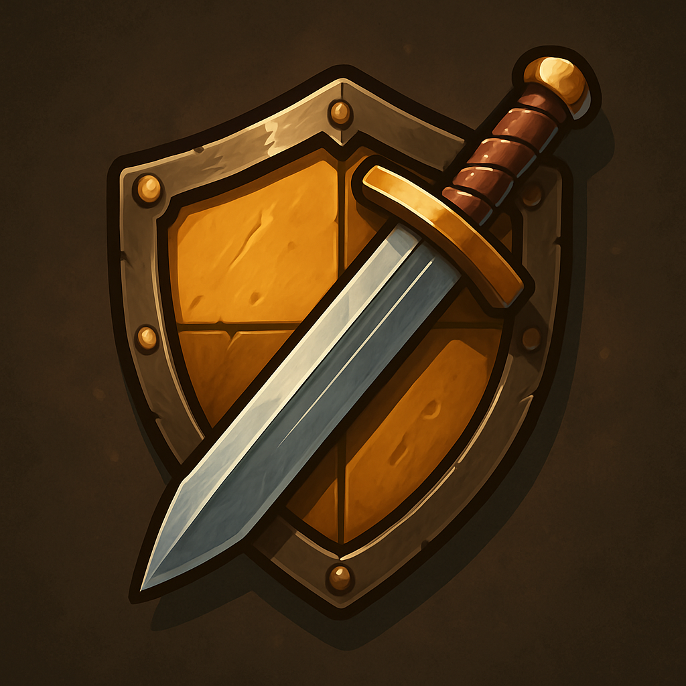

<div align="center">



## NekroRPG

</div>

Projekt NekroRPG to tekstowa gra RPG napisana w Pythonie. Gracz wciela się w bohatera przemierzającego mroczny świat pełen potworów, lochów oraz tajemniczych postaci.

## Funkcjonalności

* Tworzenie i rozwój postaci (statystyki, poziomy, umiejętności)
* System walki turowej z różnymi rodzajami potworów
* Eksploracja losowo generowanych lochów i map
* Zarządzanie ekwipunkiem (bronie, zbroje, przedmioty użytkowe)
* Zapis i wczytywanie stanu gry
* Modularna architektura: pliki w katalogu `core` zawierają rdzeń gry, a `utils` zawiera pomocnicze funkcje oraz narzędzia wspierające

## Wymagania

* Python 3.7 lub nowszy
* `pip install -r requirements.txt`

## Instalacja

1. Sklonuj repozytorium:

   ```bash
   git clone https://github.com/kmiecikelo/NekroRPG.git
   cd NekroRPG
   ```
2. (Opcjonalnie) Zainstaluj zależności:

   ```bash
   pip install -r requirements.txt
   ```

## Uruchomienie

Aby rozpocząć grę, uruchom:

```bash
python main.py
```

## Struktura projektu

```
NekroRPG/
├── core/         # Główny silnik gry (obsługa postaci, potworów, logiki)
├── utils/        # Funkcje pomocnicze (wejście/wyjście, losowanie, obsługa plików)
├── main.py       # Główny plik uruchamiający grę
├── .gitignore    # Plik z listą ignorowanych plików Git
├── .gitattributes# Konfiguracja atrybutów Git
└── README.md     # Ten plik
```

## Wkład

Wszystkie propozycje zmian i poprawki są mile widziane. Aby wnieść wkład:

1. Sforkuj repozytorium
2. Utwórz nowy branch: `git checkout -b feature/nazwa-funkcji`
3. Wprowadź zmiany i zatwierdź je: `git commit -m "Dodaj opis zmian"`
4. Wypchnij gałąź: `git push origin feature/nazwa-funkcji`
5. Otwórz pull request na GitHubie

## Licencja

Projekt jest udostępniony na licencji MIT. Zobacz plik [LICENSE](LICENSE) po więcej informacji.

---

*Życzymy miłej gry!*
